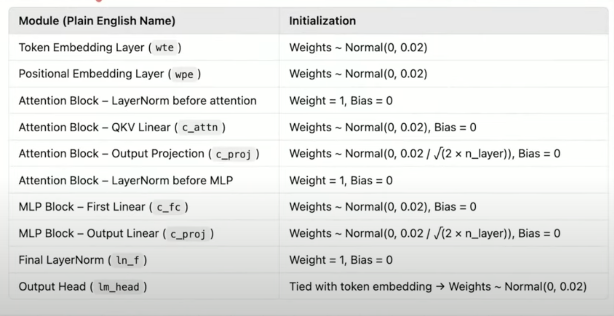

# Small Language Model Implementation

A PyTorch implementation of a GPT-style language model trained on the TinyStories dataset. This project implements a small transformer-based language model with the following key features:

## Model Architecture
- Token and positional embeddings
- Multi-head self attention with optional Flash Attention
- Layer normalization and MLP blocks
- Weight initialization following the GPT architecture

## Training Details
- Dataset: TinyStories 
- Tokenizer: GPT-2 tokenizer (50257 tokens)
- Context length: 128 tokens
- Model size: 6 layers, 6 heads, 384 embedding dimension

## Optimizations
- Mixed precision training (bfloat16/float16)
- Gradient accumulation
- Learning rate scheduling with warmup
- Weight decay and gradient clipping
- Validation-based model checkpointing

## Requirements
- PyTorch
- Datasets
- Tiktoken
- NumPy
- Matplotlib
- tqdm

## Usage
The model can be trained on any text dataset. It includes generation capabilities for text completion given a prompt.

## Model Initialization
- Token Embedding: N(0, 0.02)
- Positional Embedding: N(0, 0.02) 
- Layer Normalization: Weight=1, Bias=0
- Linear Layers: N(0, 0.02)
- Output Layer: Weight tied with token embedding

## Model variable definition
